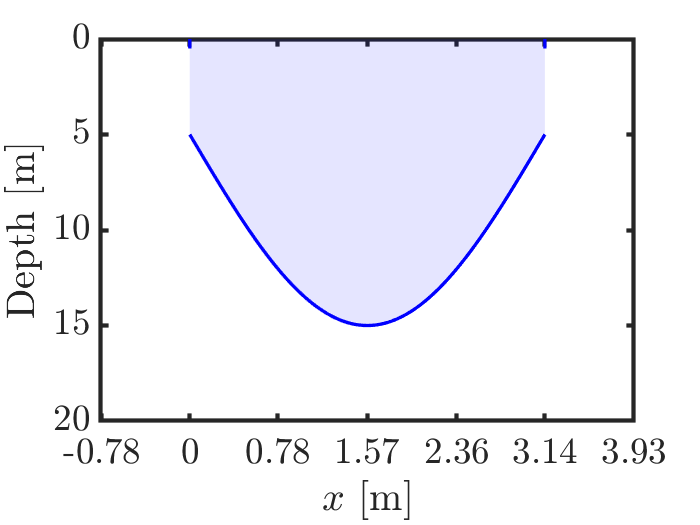
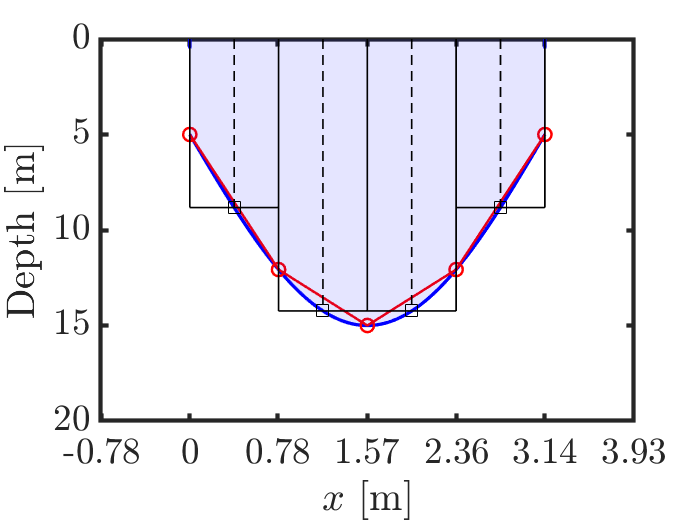
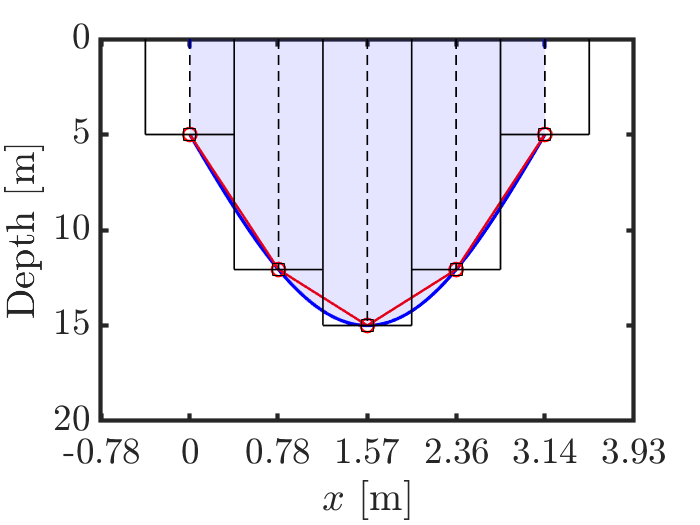
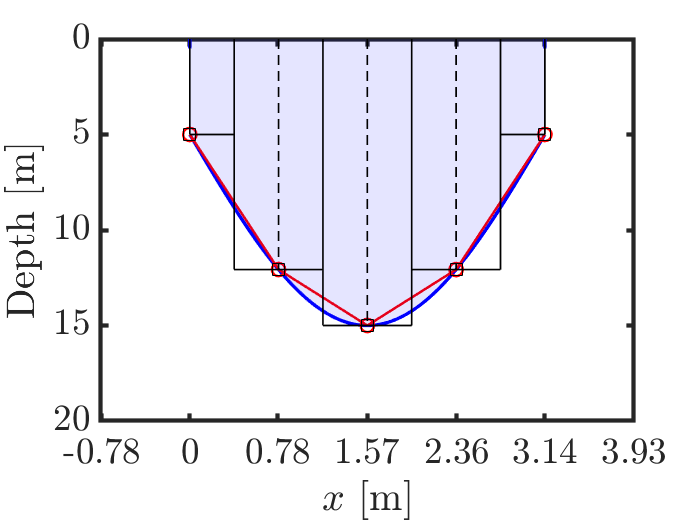
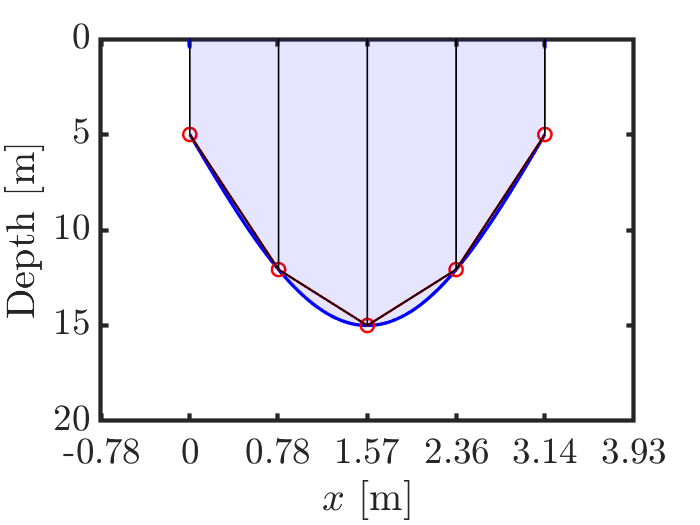
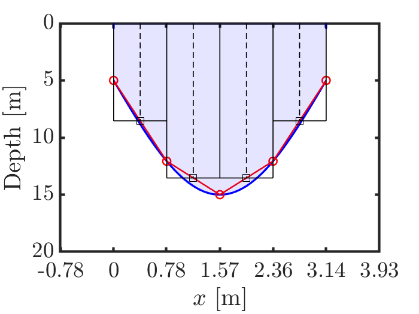
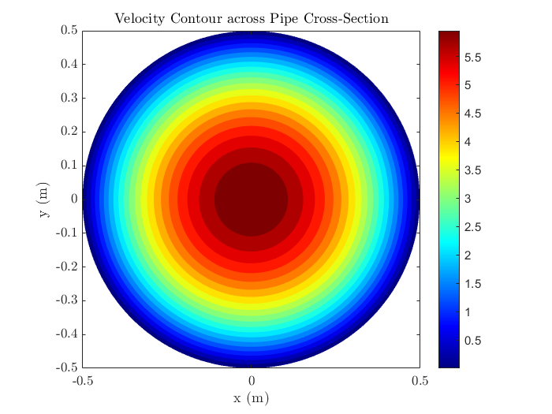
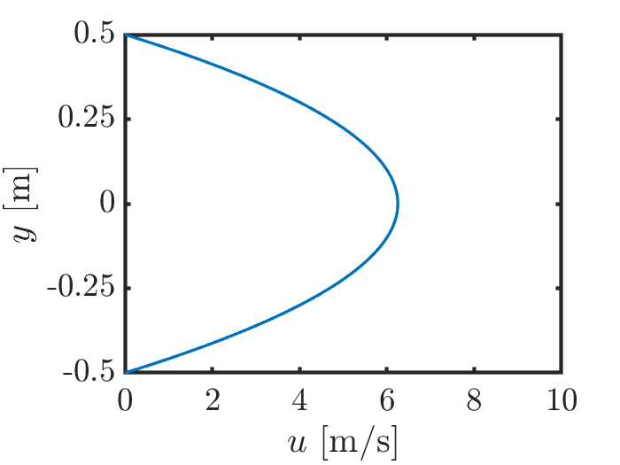

# Lecture 6: Numerical Integration of 1D Functions


This directory contains the soultion pythhon scripts for exercises 1-8 below. These exercises demostrate performing numerical integration using different commonly used methods. Exercises 1-4 involve intgration of an 1D function, and exercises 5-8 involve performing summation on 2D domain. Both uniform and non-uniform grids are considered.


## Exercise 1.

Calculate the area of a river cross-section (shaded area in Fig. 1). The depth of the river bed varies as,

```math
   y = f(x) = 5.0 + 10.0 \sin(x) \; ,
```
where $x$ indicates the span of the river, $0 \le x \le \pi$ m.

 Fig. 1


### Method 1: Analytical solution
```math
   \text{Area} = {{\int}_0}^\pi y \, dx 
   = {{\int}_0}^\pi \left\{ 5.0 + 10.0 \sin(x) \right\} \, dx
   = \left[ 5.0 x - 10.0 \cos(x) \right]_0^\pi
   = 35.708 \;\; \text{m}^2
```
This method is possible only when functional form of $y$ is such that the integration can be performed analytically quite easily.

Next, use 'for' loop to compute the area following the methods 2 to 5 below. Note the limits of index ' i ' carefully in each of these cases. Generate $x_i$ linearly spaced between $0$ and $\pi$ with total $n$ data points (consider $n=5$, initially). Compute $y_i$ for each $x_i$.

---

### Method 2: Numerical integration by rectangle rule (approximate the total area under the curve as a sum of multiple rectangular areas)

```math
   \text{Area} = {\sum}_{i=0}^{n-2} \; \Delta x \times f\left( \frac{x_i + x_{i+1}}{2} \right)
```
This method can be employed only if the functional form of $y$ i.e. $f(x)$ is known. See visual representation in Fig. 2.

 Fig. 2

---

### Method 3: compute the summation only based on the $y_i$ data

```math
   \text{Area} = {\sum}_{i=0}^{n-1} \; \Delta x \times y_i
```
See visual representation in Fig. 3.

 Fig. 3

---


### Method 4: similar to method 3 with corrections at the boundaries

```math
   \text{Area} = \frac{\Delta x}{2} \times y_0 + \left( {\sum}_{i=1}^{n-2} \; \Delta x \times y_i \right) + \frac{\Delta x}{2} \times y_{n-1}
```
See visual representation in Fig. 4.

 Fig. 4

---

### Method 5: Trapezoidal rule (approximate the total area under the curve as a sum of multiple trapezoidal areas)

```math
   \text{Area} = {\sum}_{i=0}^{n-2} \; \Delta x \times \frac{y_i + y_{i+1}}{2}
```
This method can be visually represented in two different ways; see Figs. 5a and 5b.

 Fig. 5a
 Fig. 5b

---

Note for methods 3, 4 and 5, one does not need to know the exact functional form of $y$, and the area can be calculated only from the sampled data. Can you identify the difference between Fig. 2 and Fig. 5b looking at their visual representation?

---

## Exercise 2.

Use appropriate Python `numpy` functions (`numpy.sum`, `numpy.trapz` etc.)to compute the integration methods 2 to 5 in vectorized format and without using 'for' loop (methods 6 to 9 respectively).

---

## Exercise 3.

Calculate the error in computing the area for each of the methods 2 to 9. Next put you entire code inside a 'for' loop to vary number of grid points $n$ from $2$ to $100$. Plot how the error evolves with $n$ for all the above methods in a single figure. See which method has the best convergence rate.

---

## Exercise 4.

Generate $x$ spaced in a non-uniform manner, i.e., $\Delta x$ is not constant. Use `x = numpy.linspace(0, 1, n)**2 * numpy.pi`. Now, repeat the exercise 1 to 3 and see how to modify those methods for nonuniform mesh. Which of the above methods 2 to 5 does not work for nonuniform mesh? Think of appropriate python `numpy` functions to use for nonuniform mesh.

---


# Lecture 7: Numerical Integration on 2D Domain

## Exercise 5.

Compute average flow velocity through a circular duct of radius, $R=0.5$ m. For a laminar flow through the duct, the velocity distribution on the cross-section can be obtained using Hagen-Poiseuille flow equation given by,

```math
   u(r) = u_{\text{max}}\left\{ 1 - \left( \frac{r}{R} \right)^2 \right\} \; , \quad \text{where} \quad
   u_{\text{max}} = -\frac{dp}{dx} \, \frac{R^2}{4\mu} \; .
```

Here $\frac{dp}{dx}$ is the pressure gradient, and $\mu$ is the viscosity of the fluid. Consider, $\frac{dp}{dx} = -0.1$ Pa/m and $\mu = 0.001$ Pa-s. The theoretical value of average flow velocity through the duct should be $u_{\text{max}} / 2$ m/s.

 Fig. 6a
 Fig. 6b

**Hint:** Generate a 2D uniform mesh ($x_{i,j}$, $y_{i,j}$) in the range $\left[-R, \, R\right]$ using `numpy.meshgrid`. Compute the radial distance from origin $r_{i,j}$ for each ($x_{i,j}$, $y_{i,j}$) location. Compute $u_{i,j}$ at each ($x_{i,j}$, $y_{i,j}$) using the Hagen-Poiseuille equation given above. Set $u_{i,j}$ = `numpy.nan` at all the ($x_{i,j}$, $y_{i,j}$) locations for which $r_{i,j} > R$. Visualize the u-velocity field using contour plot (Fig. 6a). Also, plot the velocity variation along the center line of the cross-section (Fig. 6b).
Now the average flow velocity can be computed by performing the masked summation for $r_{i,j} \le R$ as given below,
```math
   u_{\text avg} = \frac{\int_A \, u \, dA}{\int_A \, dA} = 
   \frac{{\sum}_{i,j}^{r_{i,j} \le R} \; u_{i,j} \times \Delta x \times \Delta y}{ {\sum}_{i,j}^{r_{i,j} \le R} \; \Delta x \times \Delta y}
```

- First, do it using `for` loop.

- Next, try using `numpy.sum()` function.

- Finally, see what you get with `numpy.mean()` function.

Compute the error in evaluating the average velocity using the numerical methods with respect to its theoretical value. Generate convergence plot.

---

## Exercise 6.

Load the realistic river cross-section data `cross_section.npz` provided. This data contains the streamwise velocity field $u$ on a $(y,z)$ cross-section plane. Based on this velocity field find out the river depth profile. Compute the river cross-section area, average flow velocity and volume flux.

---

## Exercise 7.

Repeat the exercise 5 on a nonuniform mesh.

1. Generate a nonuniform mesh such that the grid spacing gradually decreases towards the wall of the duct. Hint for mesh generation: create a uniformly spaced `x_uniform` of $N_x$ grid points using `numpy.linspace(-1,1,Nx)`; then convert `x_uniform` to a nonuniform `x` as `x = numpy.tanh(stretch_factor * x_uniform * np.arctanh(0.5))`; finally map `x` to $\left[-R, \, R\right]$, R being the radius of the duct. Repeat the same for $y$-direction for $N_y$ number of grid points. Next create the 2D mesh using `numpy.meshgrid`. Check the mesh by plotting the grid points.

2. Calculate the average velocity following the methods mentioned in exercise 5. Do they give correct result for nonuniform mesh?


- Check what you get with `np.mean()` function.

- Try with `for` loop.

- Use vectorized format and python libraries.

- Try `interpolating` the data to a uniform mesh and then use `np.mean()`

---

## Exercise 8.

Compute the average flow velocity through a circular duct for multiple situations,

- $R = 0.5 \,\, \text{m}, \;\; \frac{dp}{dx} = -0.1 \,\, \text{Pa/m}, \;\; \mu = 0.001 \,\, \text{Pa-s}, \;\; N_x = 15, \;\; N_y = 17$

- $R = 0.2 \,\, \text{m}, \;\; \frac{dp}{dx} = -0.8 \,\, \text{Pa/m}, \;\; \mu = 0.001 \,\, \text{Pa-s}, \;\; N_x = 505, \;\; N_y = 507$

- $R = 0.5 \,\, \text{m}, \;\; \frac{dp}{dx} = -0.1 \,\, \text{Pa/m}, \;\; \mu = 0.025 \,\, \text{Pa-s}, \;\; N_x = 105, \;\; N_y = 107$


Define a `function` that takes input arguments `R`, `dpdx`, `mu`, `Nx` and `Ny` to compute the average velocity. Call the function multiple times instead of writing repeating code blocks or explicitly changing parameter values.

---